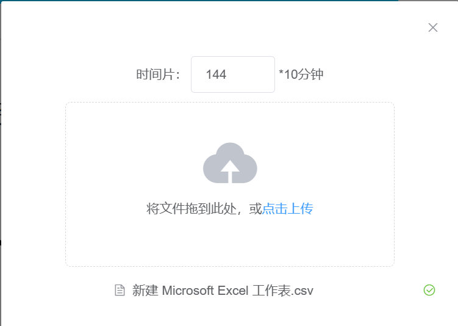

# 面向信息流构建的网络通联行为可视化方法

本组件的分析目标是基于网络通信起始点和终止点的消息流图，通过分析这些图形，自动选取出潜在的组织结构通信记录，并依赖于分析人员的交互操作进行进一步分析。为了实现这一目标，我们首先设计了基于网络通信起始点和终止点的消息流图可视化，以便对大规模网络数据进行筛选和选取。分析人员可以根据自身经验选择有价值的通信记录，进行下一步的分析。


**Demo**：[http://localhost:8080](http://localhost:8080)

## 输入数据

csv数据格式：

| source      | target      | time           |
| ----------- | ----------- | -------------- |
| 192.168.1.0 | 192.168.1.0 | 2023-8-22 0:00 |
| 192.168.1.0 | 192.168.1.0 | 2023-8-23 0:00 |
| 192.168.1.0 | 192.168.1.0 | 2023-8-24 0:00 |
| 192.168.1.0 | 192.168.1.0 | 2023-8-25 0:00 |
| 192.168.1.0 | 192.168.1.0 | 2023-8-26 0:00 |
| 192.168.1.0 | 192.168.1.0 | 2023-8-27 0:00 |

source和target分别代表消息起始点和终止点（IP段），time为时间。

json数据格式：

```javascript
 {"id": 1,"source": "192.168.1.1","target": "192.168.1.2","time": "2023-08-23 00:00"}
```

## 如何使用

### 启动

```javascript
npm run serve
```

### 导入数据

- 数据名称：`this.tabledata`
- 接口名称：`uploadFileTest`
- 操作步骤：点击导入按钮，输入时间片信息，单位为10分钟




### 数据筛选

- 数据名称：form表单`this.formInline`

- 接口名称：`onSubmit`

- 操作步骤：对IP段、时间范围、跳数、时间阈值依次进行输入和选择，点击查询，筛选后的数据展现在下方；点击重置，筛选内容清空，数据展示为全部数据。其中IP段输入格式为：IP段;IP段……以顿号分割。时间阈值的单位为导入数据中输入的时间片。

  

### 消息流绘制

- 接口名称：`generateVis2`
- 操作步骤：通过数据筛选的数据，输入纵轴精确度，点击绘制进行消息流绘制。其中筛选的IP段标红。对消息数据可以进行选择和取消选择。


## 外部接口

### 数据导出

- 数据名称：`this.filterresFromUser`

- 接口名称：`exportall`

- 接口描述：导出用户筛选后在消息流视图中选取的数据。数据格式为消息数据的ID

  ```javascript
   [1, 2, 3, 4, 5, 6, 7]
  ```

  