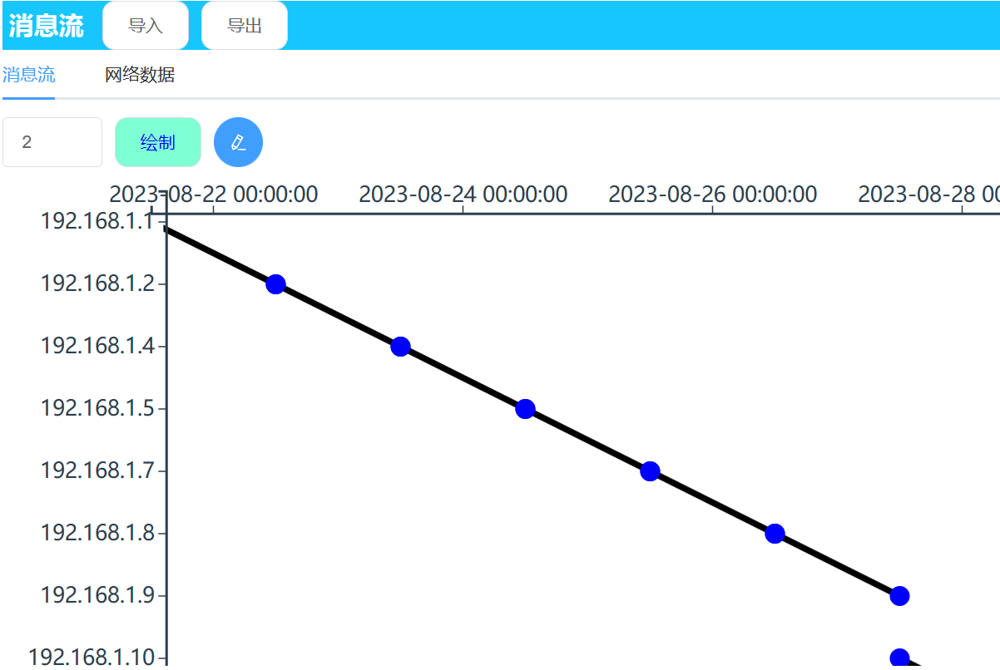

# 面向信息流构建的网络通联行为可视化方法

本组件的分析目标是基于网络通信起始点和终止点的消息流图，通过分析这些图形，自动选取出潜在的组织结构通信记录，并依赖于分析人员的交互操作进行进一步分析。为了实现这一目标，我们首先设计了基于网络通信起始点和终止点的消息流图可视化，以便对大规模网络数据进行筛选和选取。分析人员可以根据自身经验选择有价值的通信记录，进行下一步的分析。



**Demo**：[http://localhost:8080](http://localhost:8080)

## 输入数据

- 描述：网络通信数据，展示出节点之间的通信关系
- 类型：均为`Array`，满足json格式

每条信息代表一次网络通信，source和target分别代表消息起始点和终止点（IP段），time为时间。

数据的样例请详见章节[使用用例](#使用用例)

## 如何使用

### 启动

```javascript
//绘制消息流图，tabledata为检索结果
this.generateVis2(tabledata)
```

### 导入数据

- 数据名称：`this.tabledata`
- 接口名称：`uploadFileTest`
- 操作步骤：点击导入按钮，输入时间片信息，单位为10分钟


### 数据筛选

- 数据名称：form表单`this.formInline`

- 接口名称：`onSubmit`

- 操作步骤：对IP段、时间范围、跳数、时间阈值依次进行输入和选择，点击查询，筛选后的数据展现在下方；点击重置，筛选内容清空，数据展示为全部数据。其中IP段输入格式为：IP段;IP段……以顿号分割。时间阈值的单位为导入数据中输入的时间片。

  

### 消息流绘制

- 接口名称：`generateVis2`
- 操作步骤：通过数据筛选的数据，输入纵轴精确度，点击绘制进行消息流绘制。其中筛选的IP段标红。对消息数据可以进行选择和取消选择。


## 外部接口

### 数据导出

- 数据名称：`this.filterresFromUser`

- 接口名称：`exportall`

- 接口描述：导出用户筛选后在消息流视图中选取的数据。数据格式为消息数据的ID

  ```javascript
   [1, 2, 3, 4, 5, 6, 7]
  ```


## 使用用例

在本示例中，使用的数据为：

::: tabledata数据

```javascript
[
    {
        "id": 1,
        "source": "192.168.1.1",
        "target": "192.168.1.2",
        "time": "2023-08-23 00:00"
    },
    {
        "id": 2,
        "source": "192.168.1.3",
        "target": "192.168.1.4",
        "time": "2023-08-23 00:10"
    },
    {
        "id": 3,
        "source": "192.168.1.5",
        "target": "192.168.1.6",
        "time": "2023-08-23 00:20"
    },
    {
        "id": 4,
        "source": "192.168.1.7",
        "target": "192.168.1.8",
        "time": "2023-08-23 00:30"
    },
    {
        "id": 5,
        "source": "192.168.1.9",
        "target": "192.168.1.10",
        "time": "2023-08-23 00:40"
    },
    {
        "id": 6,
        "source": "192.168.1.11",
        "target": "192.168.1.12",
        "time": "2023-08-23 00:50"
    },
    {
        "id": 7,
        "source": "192.168.1.13",
        "target": "192.168.1.14",
        "time": "2023-08-23 01:00"
    },
    {
        "id": 8,
        "source": "192.168.1.15",
        "target": "192.168.1.16",
        "time": "2023-08-23 01:10"
    },
    {
        "id": 9,
        "source": "192.168.1.17",
        "target": "192.168.1.18",
        "time": "2023-08-23 01:20"
    },
    {
        "id": 10,
        "source": "192.168.1.19",
        "target": "192.168.1.20",
        "time": "2023-08-23 01:30"
    }
]
```

:::开始绘制

```javascript
const component = this.$refs["mestree"]; //这里的component指的是组件mestree.vue的vue实例

component.generateVis2(tabledata)
```

绘图效果如下所示：

