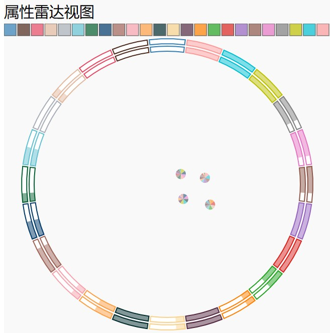

# 节点属性雷达图可视设计方法

1. 节点属性雷达图是一种观察节点属性分布的图表。当我们有一组节点数据，每个节点有n个属性，我们可以通过节点属性雷达图来可视化节点的属性分布和属性本身的特征。

2. 节点属性雷达图可以分为两个部分，包括外圈的不同颜色的圆环和内圈的大量小饼图。

3. 每个饼图代表一个节点的属性比例，不同颜色的圆环代表不同属性，饼图到各个圆环的距离表示节点与属性的相关程度。距离越近，表示节点与该属性高度相关。因此，我们可以观察所有饼图的位置分布来判断哪些节点与哪些属性相关。

4. 圆环本身也编码了属性的统计信息，如非0比例。

## 输入数据

+ 描述：输入数据如下，其中属性不定长，但所有记录的属性名称是一致的。
+ 类型：均为`Array`，满足json格式
```c
[
   { id: 0, node: "192.168.1.1", time: "2020-19-20 10:00", attr_0: 0.1, ..., attr_n: 0.1 },
   { id: 1, node: "192.168.1.2", time: "2020-19-20 10:00", attr_0: 0.1, ..., attr_n: 0.1 },
   { id: 2, node: "192.168.1.3", time: "2020-19-20 10:00", attr_0: 0.1, ..., attr_n: 0.1 },
   { id: 3, node: "192.168.1.4", time: "2020-19-20 10:00", attr_0: 0.1, ..., attr_n: 0.1 },
   { id: 4, node: "192.168.1.5", time: "2020-19-20 10:00", attr_0: 0.1, ..., attr_n: 0.1 },
]
```
### 注意
1. 获得数据后，组件会根据ip进行聚合（不同的记录可以来自相同的ip），保证每个饼图对应一个ip。聚合方式是累加聚合，即先对相同的attr进行累加平均，再计算不同attr的比例，从而绘制饼图和计算到不同圆环的距离。

## 如何使用
### 启动
```c
//this为组件radviz.vue的vue实例，data为数据,queryIns和card不用管
this.initRadviz();
this.setDataSource(data, queryIns, card)
```
### 交互
此组件包含两个交互。

1. 首先是属性过滤，可以点击上方的颜色方块来选中或取消某个属性的展示，方块颜色和圆环颜色一一对应。取消则节点属性雷达图不再计算和显示该属性的圆环，所有饼图也不计算和显示该属性的比例。选中则反之。请注意，初始状态是选中，当取消展示，方块会变得透明，当重新选中，方块的透明度会复原。

2. 其次是圈选，可以通过鼠标左键圈选一组饼图。圈选后选中的饼图饱和度提高，未选中的饼图变得透明。选中的饼图的节点id信息将生成一个事件，发送到更上层的组件中。

## 外部接口

### 发送
#### 圈选数据
+ 接口名称：`lassoPoints`
+ 交互描述：鼠标圈选点，处于圈选状态的点的id会向外发送
+ 数据格式：`array`类型的数据，满足json格式。数组的每一个元素也是一个`array`，对应处于圈选状态的id

### 接收
#### 高亮数据
+ 接口名称：`hoverPoints`
+ 交互描述：接收一个id数组，符合该id数组的饼图将被高亮
+ 数据格式：`array`类型的数据，满足json格式。数组的每一个元素也是一个`array`，对应处于圈选状态的id

## 使用示例
样例数据如下
```c
[
                {"id": "0", "node": "238.103.29.241", "time": "2023-09-21 00:00:00", "attr_0": 0, "attr_1": 0, "attr_2": 0, "attr_3": 9.56218651138595, "attr_4": 0, "attr_5": 5.966521018056097, "attr_6": 0, "attr_7": 0, "attr_8": 0, "attr_9": 0, "attr_10": 0, "attr_11": 2.055553380512558, "attr_12": 0, "attr_13": 4.657096513034372, "attr_14": 9.837651048084641, "attr_15": 9.158556075592006, "attr_16": 9.717660772291145, "attr_17": 3.035579956028852, "attr_18": 4.330988990440886, "attr_19": 0, "attr_20": 5.929435955792148, "attr_21": 1.8587247949595276, "attr_22": 3.0692302440259898, "attr_23": 0.8143816977305307}, 
                {"id": "1", "node": "59.180.146.243", "time": "2023-09-02 00:00:00", "attr_0": 0, "attr_1": 0, "attr_2": 0, "attr_3": 0, "attr_4": 0, "attr_5": 5.580977879421724, "attr_6": 0, "attr_7": 0, "attr_8": 3.836884360187377, "attr_9": 0, "attr_10": 4.0999822732473, "attr_11": 1.2932375677836894, "attr_12": 2.7152406798454054, "attr_13": 3.9315468792080885, "attr_14": 0, "attr_15": 0, "attr_16": 2.8626181749204394, "attr_17": 7.932111177732141, "attr_18": 8.420848396757595, "attr_19": 0.12639855724374427, "attr_20": 3.1204121279813544, "attr_21": 0.2835719853276486, "attr_22": 8.838561234867669, "attr_23": 9.304053695951076}, 
                {"id": "2", "node": "169.76.131.141", "time": "2023-09-08 00:00:00", "attr_0": 0, "attr_1": 0, "attr_2": 0, "attr_3": 0, "attr_4": 0, "attr_5": 0, "attr_6": 7.558999656579822, "attr_7": 8.216863336221252, "attr_8": 6.88822739917957, "attr_9": 0, "attr_10": 0, "attr_11": 2.302691664817268, "attr_12": 0, "attr_13": 2.7829147997185375, "attr_14": 0, "attr_15": 0.9658692360806431, "attr_16": 3.2486593029106148, "attr_17": 3.181826107798069, "attr_18": 2.4854341574686725, "attr_19": 8.210032694468683, "attr_20": 2.0321570178788373, "attr_21": 9.650744413331045, "attr_22": 1.658946999642994, "attr_23": 7.870103448491248}, 
                {"id": "3", "node": "210.115.149.80", "time": "2023-09-26 00:00:00", "attr_0": 0, "attr_1": 0, "attr_2": 0, "attr_3": 0, "attr_4": 0, "attr_5": 0, "attr_6": 0, "attr_7": 9.216970572807027, "attr_8": 2.082845392055922, "attr_9": 2.043498323566917, "attr_10": 6.9335785274666595, "attr_11": 8.404637071747901, "attr_12": 0, "attr_13": 6.939188041712501, "attr_14": 0, "attr_15": 0, "attr_16": 0.596734305458203, "attr_17": 5.3806971027421024, "attr_18": 0, "attr_19": 8.63878107521439, "attr_20": 0, "attr_21": 7.76731628868602, "attr_22": 8.244655709431974, "attr_23": 5.077388504260742},
                {"id": "4", "node": "210.115.149.80", "time": "2023-09-26 00:00:00", "attr_0": 0, "attr_1": 0, "attr_2": 0, "attr_3": 0, "attr_4": 0, "attr_5": 0, "attr_6": 0, "attr_7": 9.216970572807027, "attr_8": 2.082845392055922, "attr_9": 2.043498323566917, "attr_10": 6.9335785274666595, "attr_11": 8.404637071747901, "attr_12": 0, "attr_13": 6.939188041712501, "attr_14": 0, "attr_15": 0, "attr_16": 0.596734305458203, "attr_17": 5.3806971027421024, "attr_18": 0, "attr_19": 8.63878107521439, "attr_20": 0, "attr_21": 7.76731628868602, "attr_22": 8.244655709431974, "attr_23": 4.077388504260742}
            ]
```
可视化效果为
<div align="center"></div>
